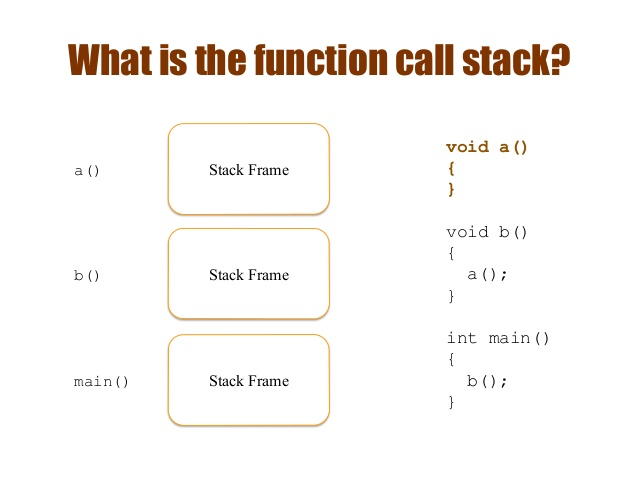

# C++ overview

### Ernesto Bascón Pantoja

Session 02

---

## Contents

- Functions
- Variables
- Callstack and heap
- Parameters passing
- Pointers
- References
- Arrays

---

# Functions 

---

## Functions

- Named code blocks.
- Useful to execute a specific functionality.
- They can return a value.
- They can receive parameters.
- They can be overloaded (only C++)
- They can invoke other functions.
- They can invoke themselves (recursion).

---

## Functions

- In C, all parameters are passed by value.
- In C++, parameters can be passed by reference.
- All functions must be already declared/defined to be invoked.

---

# Variables

---

## Variables

- Variable is a named-thing that contains a value of a given type.
- Variables can be:
    - Local, when they are defined inside a function.
    - Global, when they are defined outside a function.
    - Static, when they are available through the whole program life.
    
---

## Variables

- If the local variables of primitive type are not initialized, the compiler DOES NOT initialize them.

---

# Call stack

---

## Call stack

- Pre-allocated memory stack of fixed size (in C++).
- Stack lets the program to store the state of a previous function and the returning point to it.
- Each thread has its own call stack.

---

## Call stack



---


## Call stack

- Each stack element (*stackframe*):
    - Is created when a function is invoked.
    - Stores that function's local variables values.
    - The local variables are destroyed when they go out of scope.
    - Stores code location that will be executed after finishing the current function execution.

---


# Heap

---

## Heap (or free store)

- All memory available for the process for this program.
- It can be huge (3Gb in 32-bit Windows)
- All dynamic data a program uses is stored there.
- In C++ the heap management is done by the programmer.

---

# Parameter passing

---

## Parameter passing

- In C, all parameters are passed by value to the invoked functions.
- Pass-by-value means the parameters sent to a function, are copied to local variables inside the invoked function.
- The local variable can be modified arbitrarily.
- The values on original variable do not get modified.

---

## Pass-by-value

```
int sum(int a, int b)
{
  int r = a + b;
  return r;
}
```

---

# Pointers

---

## Pointers

- Pointers are variables that store a memory address instead of a value.
- Its type says the type of the data stored in such memory address.

---

## Pointers

```
int main()
{
   // Do not do this at home!!!
   int* p = (int*) 0xDEADBEEF; // the * says: 'p' is a pointer to an int in address 0xDEADBEEF.
   std::cout << p << "\n";
}
```

---

## Pointers

- You MUST NOT set a memory address manually (as I did in my example) because we coders do not know specific memory addresses.
- You can assign any memory address to a pointer, but if you try to access to that memory address, you will probably get a "segmentation fault".

---

## Pointers

- If you do not initialize a pointer, it contains an unknown value.
- Any pointer pointing to unknown addresses, are called **dangling pointers**.

---

## Operators

- **`*`** returns the value stored in the memory address stored in a pointer.
- **`&`** returns the memory address where a variable value is stored.

---

## Pointers

```
int main()
{
  int n = 25;
  int* np = &n;    // give me the memory address where n is located at
  *np = *np + 1;   // get the value in that memory address, add it 1 and put that value in that address
  std::cout << *np << "\n"; // print the value in that memory address
  std::cout << n << "\n";   //print the value of variable n
}

```
---
## `void*` pointers


- Pointers containing memory addresses.
- Do not know the data type being used.
- To use them properly, the programmer must cast to the specific data type.

---

## Pointer arithmetic

- You can add or subtract values from a pointer.
- Adding or subtracting means to move one pointer value one or more "elements".
- The number of bytes "added" or "subtracted" depends on the size of the pointer datatype.
- **`void*`** pointers do not support pointer arithmetic.

---

# References

---

## References

- Only C++.
- They are kind of "higher level" pointers.
- They represent a variable.
- They do not have operators to access value/memory address 
- Internally are treated as pointers.

---

## References

- They are initialized when created.
- They CANNOT be created without initialization.
- The binding between a reference and its associated variable stands forever.
- There is no "null reference" concept.
- No "reference arithmetic".

---

## References

```
int main()
{
  int n = 100;
  int& nr = n;  // creates a reference to n called nr
  nr = nr - 10; // any access to nr means access no n
  std::cout << nr << "\n"; // show the value stored in the variable 
                // referenced by nr
  std::cout << n << "\n";  // show the value stored in the variable n
}

```
---

## Pass-by-reference

- References let the program pass references instead of values.
- Makes call invokation faster for complex types.
- Enables returning values through function parameters.

---

## Pass-by-reference

```
void inc(int& num)
{
  num++;
}
```

---

# Arrays

---

## Arrays

- Sets of elements of same type.
- Stored contiguously.
- Accessibles through its position inside the array [index]
- Known size at compile time.

---

## Arrays

- Size cannot be modified.
- The runtime does not know the array size, it must be handled by the programmer.
- The compiler does not do bound checking, it must be handled by the programmer.

---

## Arrays

```
int main()
{
  int arr[5];
  arr[0] = 10;
  arr[1] = 20;
  arr[2] = 30;
  arr[3] = 40;
  arr[4] = 50;
}


```


