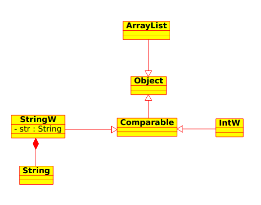

# C++ overview

### Session 08
## Example before continuing

###### *Ernesto Bascón Pantoja*

---

## Exercise

- Create a String class
- Create an Object class
- Create a Comparable class
- Create an IntW class
- Create a StringW class
- Create an ArrayList class
- Create a working example

---

## Diagram

