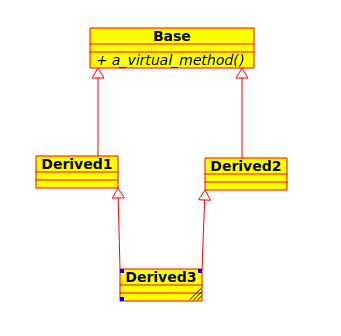

# C++ overview

### Session 09
## RTTI / Multiple inheritance / Exceptions

###### *Ernesto Bascón Pantoja*

---
# RTTI
---
## RTTI

Stands for **R**un**t**ime **T**ype **I**nformation

- Infrastructure to get type information.
- Operator **`typeid`**
- **`std::type_info`** class
- **`dynamic_cast`**

---

# Multiple inheritance

---

## Multiple inheritance

- C++ lets a class have one or more base classes.
- It lets the programmer *compose* new classes.

---

## Multiple inheritance

```
struct A { int a; int b; int c; };
struct B { int x; int y; int z; };

struct C : public A, public B
{
  int m;
};
```

---
## Multiple inheritance - Ambiguity

```
struct X { int x; };
struct Y { int x; };

struct Z : public X : public Y { };

int main()
{
    Z z; z.x; //ambiguous
    z.X::x; //unambiguous
}

```
---
## Dread diamond problem




---

## Virtual inheritance

- Removes ambiguity on base members.
- Only **`dynamic_cast`** works
- No constructors on base classes are invoked automatically
- Good for ABCs.

---
## Virtual inheritance

```
struct A { int x; };
struct B : public virtual A { };
struct C : public virtual A { };
struct D : public B, public C { };

int main()
{
    D d; d.x; // unambiguous because virtual inheritance
}

```

---
# Exceptions
---
## Exceptions

- An *exception* is something unexpected occurring.
- When an exception is thrown, the normal control flow is interrupted.
- The programmer can create exception handlers.
- If no exception handlers found, the program exits abnormally.

---
## Exceptions

- Arithmetical errors or segmentation faults are not handled by exceptions.
- In C++, *anything* can be thrown when an exception occurs.
- A generic exception handler can be implemented too.
- Several exception handlers can be implemented.
---

## Exceptions

```
void p()
{
    throw 1;
}

void m()
{
    try
    {
      p();
    }
    catch (int e) { std::cerr << "Error code: " << e << "\n"; }
}
```
---
## Exceptions
```
void p()
{
    throw "An error occurred";
}

void m()
{
    try
    {
      p();
    }
    catch (...) { std::cerr << "Unknown error occurred"; }
}
```
---
## Exceptions

- No **`finally`** keyword exists in C++.
- Resources should be handled through RAII.
- When an exception occurs in the constructor, the object is not completely constructed.
---

## Exceptions 

- No *checked exceptions* like in Java.
- The programmer can mark the methods that do not throw exceptions with: **`noexcept`**
- If method marked with **`noexcept`** and an exception occurs on it, the program terminates abruptly.
---

## Exceptions

- C++ standard library ships with **`std::exception`** class.
- The programmer can/should inherit from it.
- Some known derived classes from it:
    - `std::out_of_range`
    - `std::bad_alloc`
    - `std::bad_cast`


